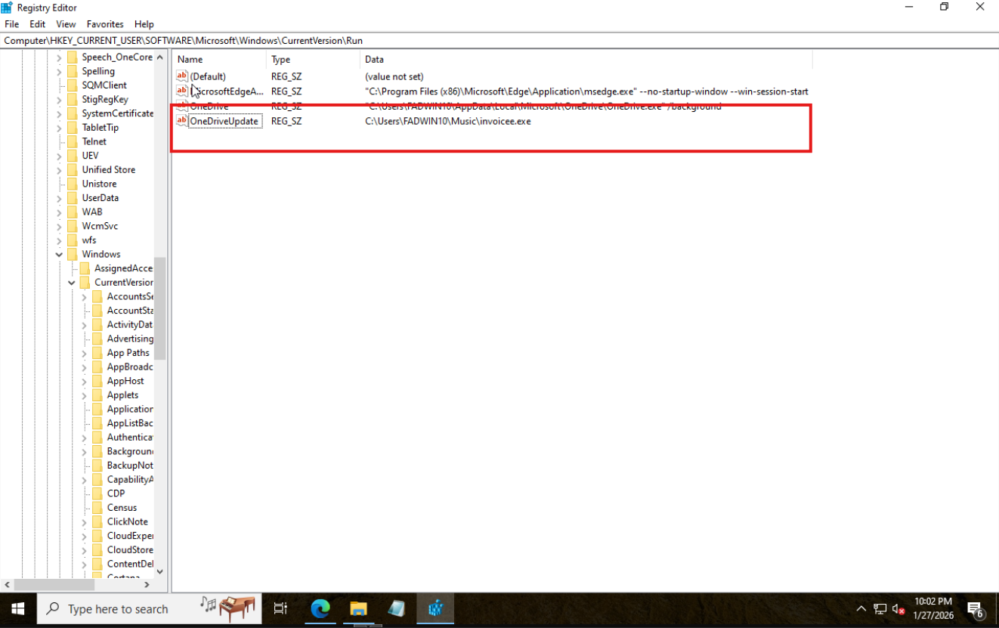
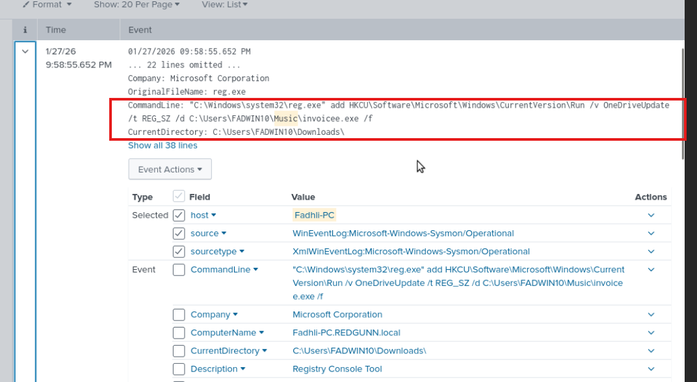
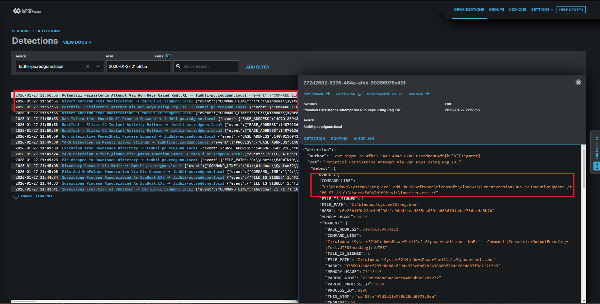
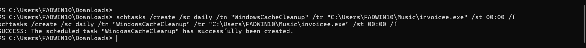
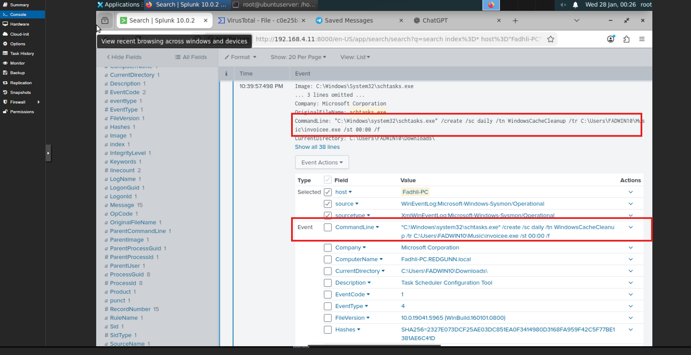
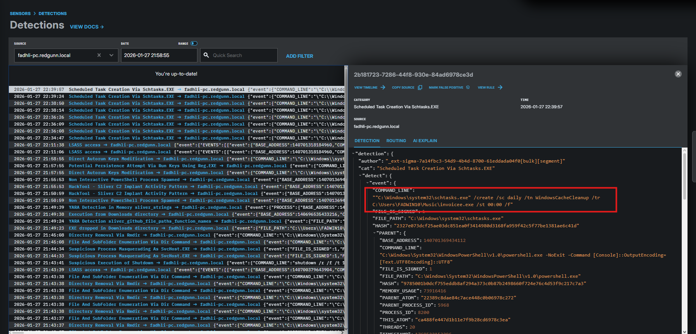
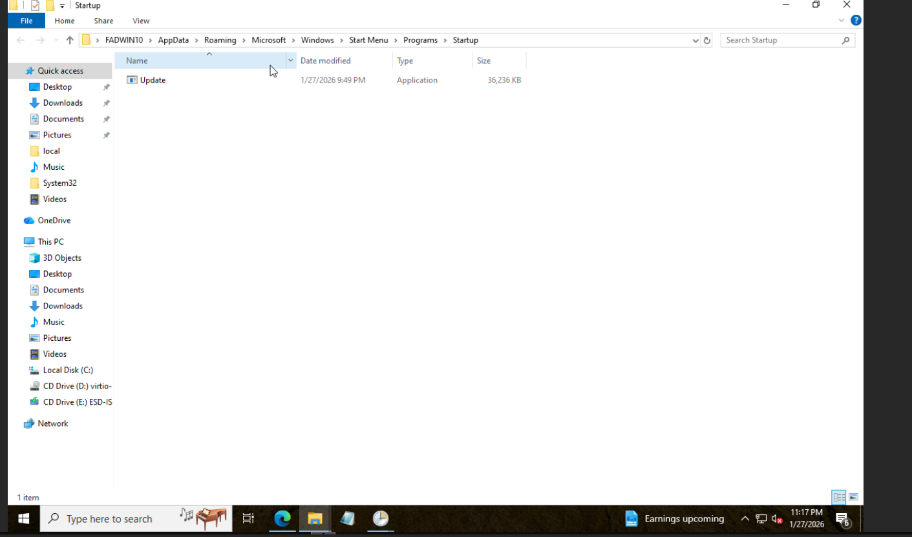
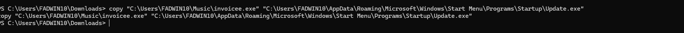
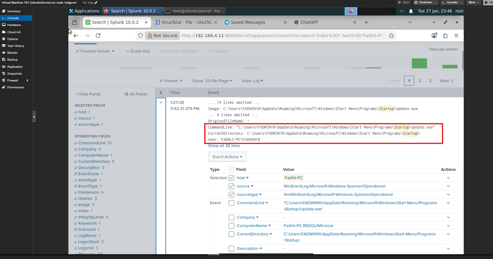

# Phase 3: Persistence (TA0003)

## Objective
The goal of this phase is to demonstrate how an attacker maintains access to a compromised system **across reboots and user logins**.

**MITRE ATT&CK Techniques**
- **T1547.001** – Boot or Logon Autostart Execution (Registry Run Keys / Startup Folder)
- **T1053.005** – Scheduled Task/Job (Scheduled Task)

---

## 🚩 Phase 3a: Registry Run Keys

### Scenario
A persistence mechanism is established by adding an entry to the **HKCU Run registry key**, causing the implant to execute automatically whenever the user logs in.

**Technique:** T1547.001 – Registry Run Keys

---

### 1. Red Team Action (Sliver / CMD)

Executed on the victim machine via an active Sliver shell:

    reg add "HKCU\Software\Microsoft\Windows\CurrentVersion\Run" /v "OneDriveUpdate" /t REG_SZ /d "C:\Users\FADWIN10\Music\invoicee.exe" /f

**Why this works**
- The `Run` key is a well-known and commonly abused persistence location in Windows environments.

**Stealth**
- The registry value name **OneDriveUpdate** is chosen to resemble legitimate software behavior.

  

  <em>Figure 3.1: Sliver session showing successful execution of the <code>reg add</code> command</em>

  

  <em>Figure 3.2: Registry Editor showing the malicious Run key entry</em>

---

### 2. Blue Team Detection – Splunk

**Log Source**
- Sysmon Event ID 1 (Process Creation)

> In environments where Registry Event ID 13 is not enabled, process creation logs are commonly used to detect registry modifications.

**Splunk Query**

    index="Fadhli-PC" EventCode=1
    Image="*\\reg.exe"
    CommandLine="*add*" AND CommandLine="*\\Run*"
    | table _time, User, CommandLine, ParentImage

**Observation**
- The query captures `reg.exe` modifying the `CurrentVersion\Run` key.

  

  <em>Figure 3.3: Splunk results showing suspicious <code>reg.exe</code> command execution</em>

---

### 3. LimaCharlie Detection

**What LimaCharlie Observes**
- The EDR detects the activity in real time by matching it against known persistence behavior.

**Alert Details**
- Detection Name: Potential Persistence Attempt Via Run Keys Using Reg.EXE  
- Source: refractionPOINT (Sigma rules)  
- Event Trigger: NEW_PROCESS  

**Detection Logic**

    op: and
    rules:
      - op: ends with
        path: event/FILE_PATH
        value: reg.exe
      - op: contains
        path: event/COMMAND_LINE
        value: \Software\Microsoft\Windows\CurrentVersion\Run

**SOC Assessment**
- High-confidence persistence alert
- Binary executed from a non-standard user directory
- Activity confirmed as malicious

  

  <em>Figure 3.4: LimaCharlie alert details for registry-based persistence</em>

---

## 🚩 Phase 3b: Scheduled Tasks

### Scenario
Persistence is established by creating a Windows Scheduled Task that executes the implant on a recurring basis.

**Technique:** T1053.005 – Scheduled Task

---

### 1. Red Team Action (Sliver / CMD)

    schtasks /create /sc daily /tn "WindowsCacheCleanup" /tr "C:\Users\FADWIN10\Music\invoicee.exe" /st 00:00 /f

**Stealth**
- The task name **WindowsCacheCleanup** is designed to appear as a routine system maintenance job.

  

  <em>Figure 3.5: Sliver shell output confirming scheduled task creation</em>

  

  <em>Figure 3.6: Scheduled task name masquerading as a system maintenance job</em>

---

### 2. Blue Team Detection – Splunk

**Log Source**
- Sysmon Event ID 1 (Process Creation)

**Splunk Query**

    index=windows EventCode=1
    Image="*\\schtasks.exe"
    CommandLine="*/create*"
    | table _time, User, CommandLine, ParentImage

**Analysis**
- Task Name: WindowsCacheCleanup  
- Payload Location: `C:\Users\FADWIN10\Music\invoicee.exe`  
- Execution Schedule: Daily at 00:00  

**Conclusion**
- Persistence via scheduled task is confirmed.

  

  <em>Figure 3.7: Splunk results highlighting <code>schtasks.exe /create</code></em>

---

### 3. LimaCharlie Detection

**Alert Details**
- Detection Name: Scheduled Task Creation Via Schtasks.EXE  
- Source: refractionPOINT  
- Event Trigger: NEW_PROCESS  

**Detection Logic**

    op: and
    rules:
      - op: ends with
        path: event/FILE_PATH
        value: schtasks.exe
      - op: contains
        path: event/COMMAND_LINE
        value: /create

**SOC Assessment**
- High-severity alert generated
- Task name attempts to masquerade as a legitimate system process
- Activity confirmed as malicious

  

  <em>Figure 3.8: LimaCharlie alert for scheduled task persistence</em>

---

## 🚩 Phase 3c: Startup Folder

### Scenario
Persistence is achieved by placing the implant directly into the user’s Startup folder, ensuring execution upon login.

**Technique:** T1547.001 – Startup Folder

---

### 1. Red Team Action (Sliver / CMD)

    copy "C:\Users\FADWIN10\Music\invoicee.exe" "C:\Users\FADWIN10\AppData\Roaming\Microsoft\Windows\Start Menu\Programs\Startup\Update.exe"

  

  <em>Figure 3.9: Startup folder contents in Windows Explorer</em>

  

  <em>Figure 3.10: Sliver shell showing successful file copy to Startup folder</em>

---

### 2. Blue Team Detection – Splunk

**Log Source**
- Sysmon Event ID 1 (Process Creation)

**Splunk Query**

    index=windows EventCode=1
    Image="*\\AppData\\Roaming\\Microsoft\\Windows\\Start Menu\\Programs\\Startup\\*"
    | table _time, User, CommandLine, ParentImage

**Evidence**
- Executable launched directly from the Startup folder
- Process triggered automatically during user login
- Parent process identified as `explorer.exe`

**Assessment**
- Executables running directly from the Startup directory are uncommon in modern software
- High-fidelity indicator of persistence via file drop

  

  <em>Figure 3.11: Splunk event showing <code>Update.exe</code> execution from Startup folder</em>

---

## 🛡️ SOC Decision & Response

**Status:** CONFIRMED INCIDENT – PERSISTENCE DETECTED

### Immediate Containment
- Scheduled task removed:

      schtasks /delete /tn "WindowsCacheCleanup" /f

- Malicious Run key value removed from HKCU  
- Active `sliver.exe` process terminated  

---

### Remediation
- Full persistence review performed using Sysinternals `autorunsc`
- User credentials reset due to confirmed full user compromise

---

### Next Steps
- Review logs for lateral movement (TA0008)
- Assess potential access to high-value assets such as a Domain Controller

