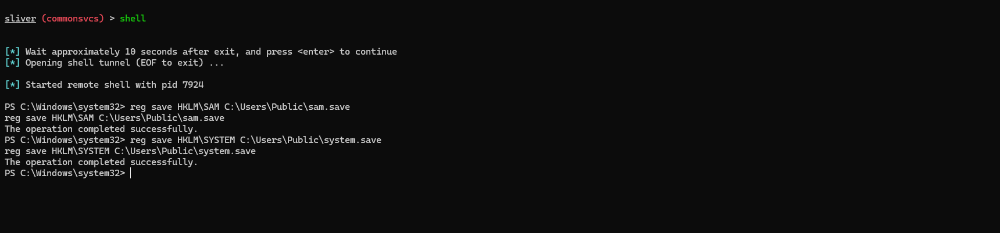
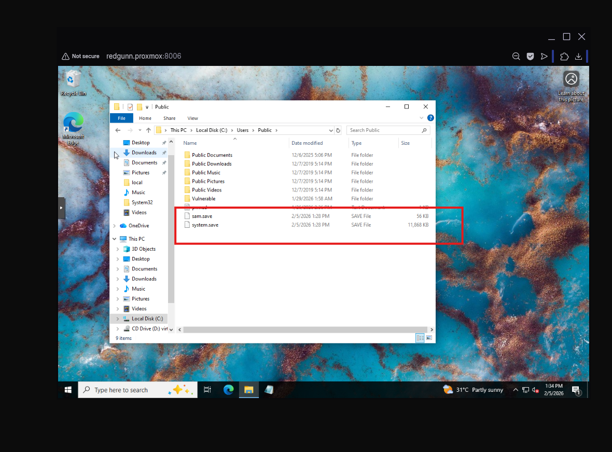
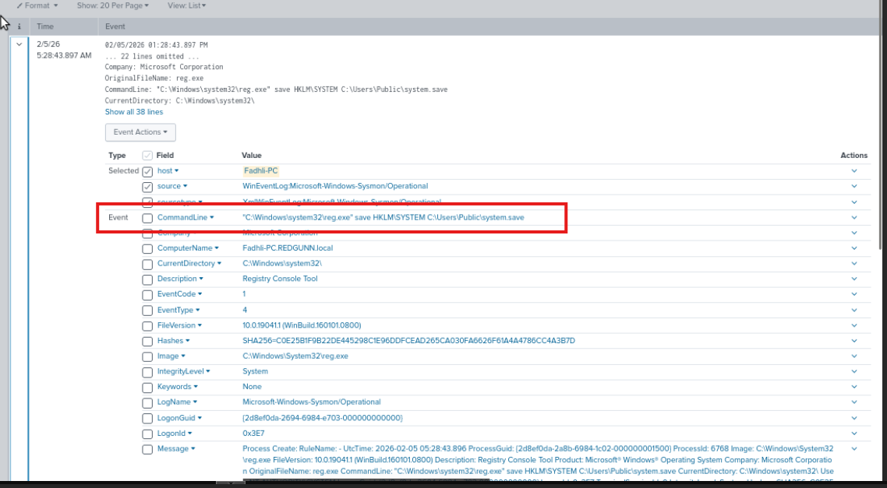
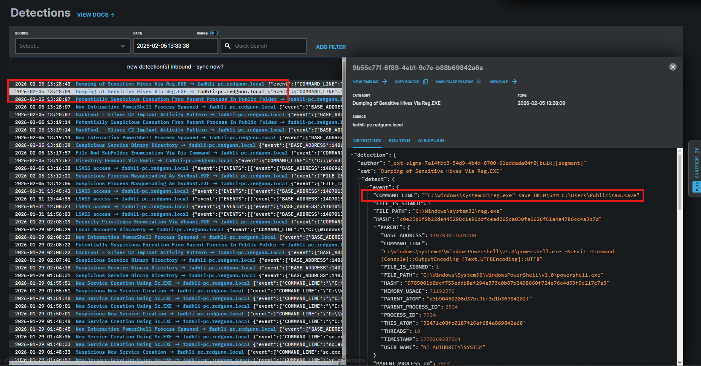
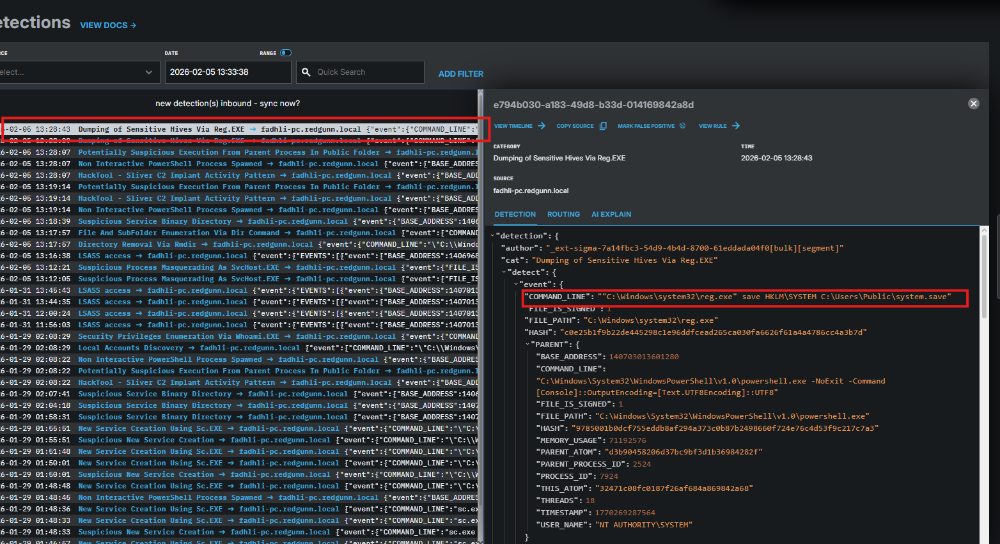

# Phase 4: Credential Access — SAM & LSASS Dumping

## Overview

**Objective**  
Obtain credential material from the compromised host to support privilege escalation and lateral movement. Password hashes and memory-resident credentials are extracted for offline cracking and credential reuse.

**MITRE ATT&CK Mapping**
- **Tactic:** TA0006 – Credential Access  
- **T1003.002:** Security Account Manager (SAM)  
- **T1003.001:** LSASS Memory  

**Strategy**  
Two credential theft techniques are demonstrated:

1. Offline hash extraction via SAM hive export  
2. In-memory credential dumping from LSASS  

---

## Scenario A — SAM Hive Extraction

**Analyst Context**  
The SAM database stores local password hashes. The SYSTEM hive contains the decryption key. Exporting both enables offline credential recovery without authentication attempts on the endpoint.

---

## Attack Simulation (Red Team)

### Step 1: Hive Export

**Command**
```
reg save HKLM\SAM C:\Users\Public\sam.save
reg save HKLM\SYSTEM C:\Users\Public\system.save
```

<p align="center">
  
</p>
<p align="center">
  <em>Figure 4.1: Native Windows command used to export credential hives</em>
</p>

<p align="center">
  
</p>
<p align="center">
  <em>Figure 4.2: Exported SAM and SYSTEM hive files written to disk</em>
</p>

The attacker leverages built-in Windows functionality to obtain encrypted credential material.

---

## Detection & Hunting (Blue Team — Splunk)

**Detection Logic**  
Manual export of credential registry hives is a high-confidence indicator of credential theft.

**Query**
```
index=windows EventCode=1 
Image="*\\reg.exe"
CommandLine="*save*" AND (CommandLine="*HKLM\\SAM*" OR CommandLine="*HKLM\\SYSTEM*")
| table _time, ComputerName, User, CommandLine
```

<p align="center">
  
</p>
<p align="center">
  <em>Figure 4.3: Splunk telemetry showing registry hive export activity</em>
</p>

**Assessment**  
Exporting SAM/SYSTEM hives has no legitimate operational purpose and strongly indicates credential harvesting.

---

## Endpoint Detection (Blue Team — LimaCharlie)

**Detection Trigger**  
Process telemetry identifies reg.exe exporting sensitive registry hives.

<p align="center">
  
</p>

<p align="center">
  
</p>
<p align="center">
  <em>Figure 4.4: Endpoint telemetry confirming credential hive export behavior</em>
</p>

**Assessment**  
Behavior aligns with credential theft activity preceding lateral movement.

---

## Scenario B — LSASS Memory Dumping

**Analyst Context**  
LSASS stores active authentication material in memory. Dumping the process exposes reusable credentials.

---

## Attack Simulation (Red Team)

### Step 2: LSASS Dump via Comsvcs.dll

**Command**
```
rundll32.exe C:\Windows\System32\comsvcs.dll, MiniDump <LSASS_PID> C:\Users\Public\lsass.dmp full
```

**[Screenshot required]**

A native Windows DLL is abused to generate a credential memory dump.

---

## Detection & Hunting (Blue Team — Splunk)

**Detection Logic**  
Use of rundll32 with MiniDump parameters indicates LSASS credential dumping.

**Query**
```
index=windows EventCode=1
Image="*\\rundll32.exe"
CommandLine="*comsvcs.dll*MiniDump*"
| table _time, ComputerName, User, CommandLine
```

**[Screenshot required]**

**Assessment**  
Access to LSASS memory outside system processes signals credential theft.

---

## Endpoint Detection (Blue Team — LimaCharlie)

**Detection Trigger**  
Suspicious LSASS access and dump creation observed in endpoint telemetry.

**[Screenshot required]**

**Assessment**  
Confirms active post-exploitation credential harvesting.

---

## SOC Decision & Response

**Status:** CONFIRMED CREDENTIAL COMPROMISE

**Actions**
- Terminate suspicious processes  
- Isolate affected host  
- Reset exposed credentials  
- Investigate follow-on authentication activity  

---

## Key Takeaway

Credential access was achieved using native Windows functionality without external malware. Detection depends on behavioral monitoring of credential storage access. This phase marks the transition from system compromise to credential control.
